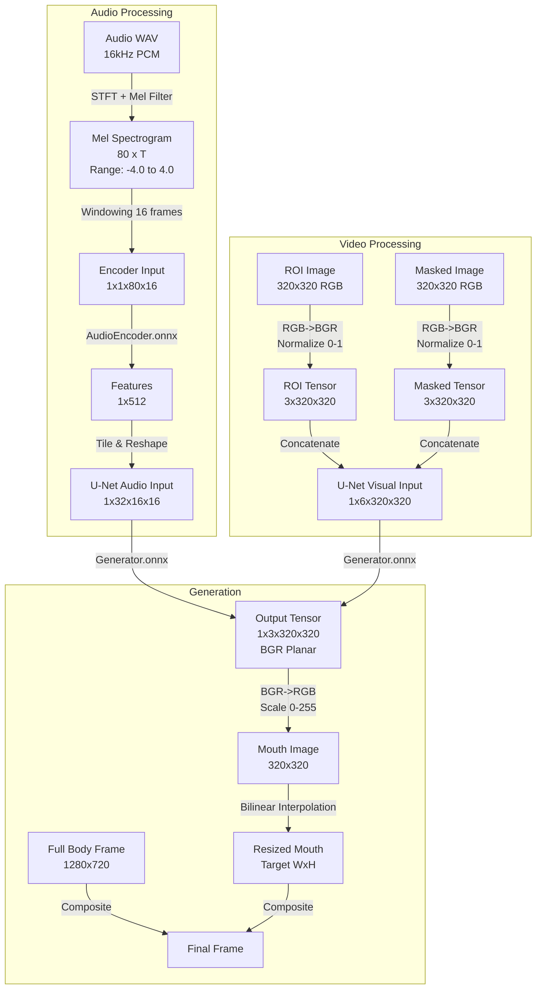

# Go Optimized Pipeline: Detailed Execution Flow

This document details the exact step-by-step execution flow of the `go_optimized` frame generation pipeline, from raw input to final video frame.

## 1. Initialization Phase

Before any processing begins, the system sets up parallel resources.

1. **Resource Allocation**
   - Detects CPU cores (e.g., 8 cores on M1 Pro).
   - Sets `GOMAXPROCS` to utilize all cores.

2. **ONNX Session Pooling (The Parallel Engine)**
   - **Audio Encoder Pool:** Creates 1 ONNX session (sequential processing is sufficient).
   - **Generator Pool:** Creates **N** ONNX sessions (where N = CPU cores).
   - *Why:* ONNX Runtime is thread-safe but has internal locks. Separate sessions allow true parallel inference.

3. **Memory Pooling (Zero-Allocation Strategy)**
   - Pre-allocates `sync.Pool` for:
     - `[]float32` tensors (6-channel input, 3-channel output).
     - `*image.RGBA` buffers (for loading and resizing).
   - *Benefit:* Eliminates Garbage Collector (GC) pauses during high-speed generation.

4. **Data Loading**
   - Loads `crop_rectangles.json` (coordinates for where the face is in each frame).
   - Initializes `TensorCache` (disk-based cache for converted image tensors).

---

## 2. Audio Processing Stage

**Input:** Raw WAV file (e.g., `audio.wav`)  
**Output:** Audio Feature Tensors `[N, 512]`

1. **Load WAV**
   - Decodes WAV header.
   - Reads 16-bit PCM integer samples.
   - Converts to `float64` normalized to `[-1.0, 1.0]`.

2. **Mel Spectrogram Generation (`pkg/mel`)**
   - **Pre-emphasis:** Applies filter `y[t] = x[t] - 0.97 * x[t-1]` (boosts high frequencies).
   - **STFT:** Short-Time Fourier Transform using Hann window (800 size, 200 hop).
   - **Mel Filterbank:** Maps linear frequencies to 80 Mel bands (55Hz - 7600Hz).
   - **Log Amplitude:** Converts to decibels (dB).
   - **Normalization:** Clips and scales values to range `[-4.0, 4.0]`.

3. **Feature Encoding (AudioEncoder Model)**
   - **Windowing:** Extracts 16-frame overlapping windows from the Mel spectrogram.
   - **Tensor Creation:** Creates ONNX tensor shape `[1, 1, 80, 16]`.
   - **Inference:** Runs `audio_encoder.onnx` to produce a 512-dimensional feature vector.
   - **Result:** A sequence of 512-float vectors, one per video frame.

---

## 3. Frame Generation Stage (Parallel)

**Input:** Audio Features, Template Images  
**Output:** Final Video Frame (1280x720)

This stage runs in **parallel batches** (default batch size: 15 frames).

### For Each Frame (running on a worker thread):

1. **Select Template Frame**
   - Determines which template frame (1-250) corresponds to the current video timestamp.
   - Paths:
     - `rois_320/{i}.jpg` (Cropped face, 320x320)
     - `model_inputs/{i}.jpg` (Masked face, 320x320, lower half black)
     - `full_body_img/{i}.jpg` (Full 1280x720 frame)

2. **Prepare Visual Input (Tensor Construction)**
   - **Check Cache:** Does `cache/go_tensors/{i}.tensor` exist?
     - **YES:** Load binary float32 data directly (Instant).
     - **NO:** Load JPEG → Decode to RGB → Convert to BGR Planar Tensor → Save to Cache.
   - **Tensor Structure:** 
     - Shape: `[1, 6, 320, 320]`
     - First 3 channels: ROI image (BGR, 0-1 normalized)
     - Next 3 channels: Masked image (BGR, 0-1 normalized)

3. **Prepare Audio Input**
   - Takes the 512-dimension vector for the current frame.
   - **Tiling:** Repeats the vector 16 times to fill 8192 elements (`512 * 16`).
   - **Reshape:** `[1, 32, 16, 16]` tensor.

4. **U-Net Inference (The Core Generation)**
   - **Acquire Session:** Grabs a free generator session from the pool.
   - **Run Model:** `generator.onnx` takes Visual Tensor + Audio Tensor.
   - **Output:** `[1, 3, 320, 320]` tensor (Generated mouth region).
   - **Release Session:** Returns session to pool for other workers.

5. **Post-Processing**
   - **Tensor to Image:**
     - Converts Planar BGR floats (`0.0-1.0`) back to Interleaved RGB bytes (`0-255`).
     - Creates a 320x320 `*image.RGBA`.

6. **Compositing (The "Paste" Step)**
   - Loads the full body frame (1280x720).
   - lookups up crop coordinates `[x1, y1, x2, y2]` from JSON.
   - **Bilinear Resizing (Crucial Step):**
     - The target face region on the full body might be e.g., `182x182` (not exactly 320x320).
     - Resizes the generated 320x320 mouth image to fit the target rect using **Bilinear Interpolation**.
     - *Note:* Originally used Nearest Neighbor, which caused pixelation.
   - Pastes the resized mouth onto the full body frame.

7. **Save Output**
   - Encodes final image to JPEG.
   - Saves to output directory (e.g., `frame_00001.jpg`).

---

## 4. Detailed Data Specifications

### A. Audio Processing Flow

| Step | Input Data | Operation | Output Data | Notes |
|------|------------|-----------|-------------|-------|
| **1. Raw Audio** | `WAV File` | `Decode` | `[]float64` | PCM 16kHz, Mono, normalized `[-1.0, 1.0]` |
| **2. Spectrogram** | `[]float64` | `STFT + Mel` | `[80, T]` Matrix | 80 Mel bands, ~50 frames/sec. Log scale dB. Normalized `[-4.0, 4.0]`. |
| **3. Encoder Input** | `[80, T]` | `Windowing` | `[1, 1, 80, 16]` | Sliding window of 16 frames (~320ms context). |
| **4. Embedding** | `[1, 1, 80, 16]` | `AudioEncoder` | `[1, 512]` | 512-dim feature vector representing mouth shape state. |
| **5. Gen Input** | `[1, 512]` | `Tile + Reshape` | `[1, 32, 16, 16]` | Tiled 16 times to match U-Net bottleneck spatial dims. |

### B. Visual Processing Flow

| Step | Input Data | Operation | Output Data | Notes |
|------|------------|-----------|-------------|-------|
| **1. Template** | `JPEG File` | `Decode` | `image.RGBA` | 320x320 pixels, RGB interleaved. |
| **2. ROI Tensor** | `image.RGBA` | `Convert` | `[3, 320, 320]` | **BGR Planar**. Normalized `[0.0, 1.0]`. |
| **3. Masked Tensor** | `image.RGBA` | `Convert` | `[3, 320, 320]` | **BGR Planar**. Normalized `[0.0, 1.0]`. |
| **4. Model Input** | ROI + Masked | `Concatenate` | `[1, 6, 320, 320]` | 6 channels stacked. BGR ordering maintained. |

### C. Generator Flow

| Step | Input Data | Operation | Output Data | Notes |
|------|------------|-----------|-------------|-------|
| **1. Inference** | Visual `[1, 6, 320, 320]` Audio `[1, 32, 16, 16]` | `U-Net Model` | `[1, 3, 320, 320]` | Generates only the mouth region. BGR Planar. Output `[0.0, 1.0]`. |
| **2. To Image** | `[1, 3, 320, 320]` | `Scale + Shuffle` | `image.RGBA` | Scale to `[0, 255]`. Shuffle Planar BGR → Interleaved RGB. |
| **3. Resize** | `320x320 Image` | **`Bilinear`** | `Target Size` | E.g., 180x180. Smooth resizing to prevent pixelation. |
| **4. Paste** | `Full Frame` + `Mouth` | `Composite` | `Final Frame` | Overwrites pixels in full body frame at target coordinates. |

---

## Data Flow Diagram

